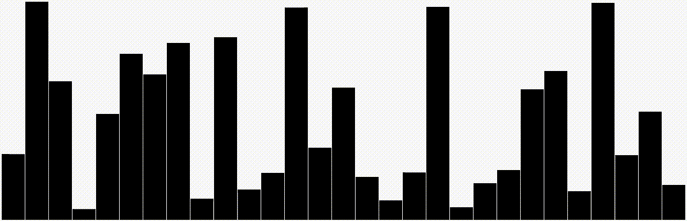

# 📊 SortingAlgorithms

Sorting algorithms visualized.

## Contributing

This project is open for any kind of contribution from anyone.

### Steps

1. Fork this repository
2. Create a new branch (optional)
3. Clone it
4. Make your changes
5. Upload them
6. Make a pull request here
7. Profit.

## Authors

* **[Martin Kondor](https://github.com/MartinKondor)**

# License

See the [LICENSE](LICENSE) file for details.
